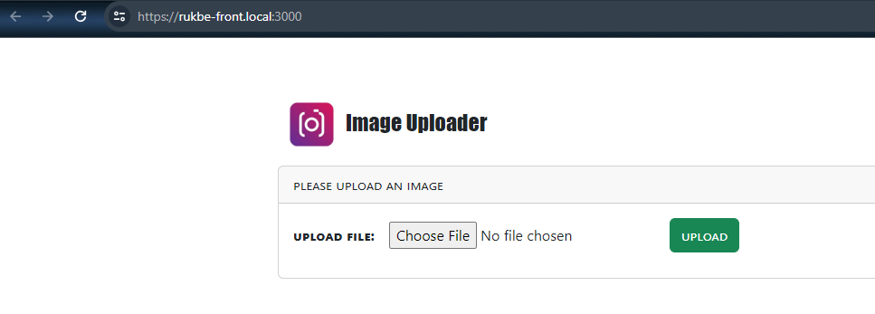

# Rukbe Coding Challenge

<pre>
   An image uploader application that allows a user to upload any image from their pc/laptop to the server.
   User will also have the ability to view the uploaded image from the server.
   <strong>Note: Advisable to only run this project in a local environment  </strong>
</pre>

### Install requirements w/ <a href='https://github.com/FiloSottile/mkcert#installing-the-ca-on-other-systems' target='blank'>`mkcert`</a> __(A locally-trusted development certificate generator tool)__

1. Ensure you have **git** & **docker** installed in your system.
2. Clone project repo <b>https://github.com/MorelSami/RukbeChallenge.git</b> to your workspace.
3. In `config/ssl-certificate-install.sh` file, update `{path/to/cloned-project-repository}` with `actual path of the project repository`. __**(Please first check the file to have a brief understanding of what it does)**__
4. Run `sh config/ssl-certificate-install.sh`. __**(Please skip this step if you decide not to install a local CA using `mkcert`)**__
5. Create an environment variable file `.env` in both the root directory and `rukbe` directory (front-end) using `.env.sample` as reference (__using the same content should be fine__).
6. Run `composer install` in the root directory.
7. Run `npm install` in the `rukbe` (front-end) directory.
8. In the root directory open `run.sh` and update `{path/to/cloned-project-repository}` with `actual path of the project repository`. 

### Execution

8. If you skipped `step 4` above, please perform the following steps below else skip to `step 9`: (*These steps should allow you run the application using an unsecured protcol(HTTP)*)
  - In the `rukbe` directory, Update env variable `HTTPS=false`and instead use the unsecured access variable `REACT_APP_API_ENDPOINT` in `.env` file. 
  - In the root directory, instead use the unsecured access variable `APP_URL` in `.env`file and comment out `line 13-14` in the `Dockerfile` file for the backend server. 
9. `sh run.sh`

Enjoy!!
